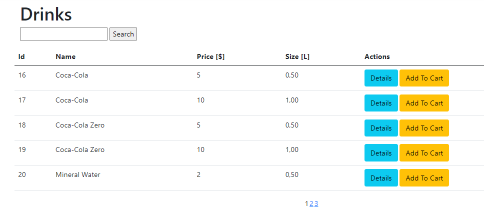

# PizzeriaImpulsMVC
> ASP.Net MVC application created in connection with the course "Zostań programistą ASP.NET  / Become an ASP.NET developer" provided by https://szkoladotneta.pl/

## Table of content
* [General](#general)
* [Technologies](#technologies)
* [Items](#items)
* [Reports](#reports)
* [ShoppingCart](#shopping_cart)
* [UserManagment](#user_managment)

## General
> PizzeriaImpulsMVC is designed in clean architecture which means whole solution is partitioned on layers.

- **Web Layer** -  layer which  contains controller and views.
- **Appliaction Layer** - this layer contains the business logic. In this layer services interfaces are kept separated from their implementation.
- **Domain Layer** - domain layer lies in the center of the architecture with application entities. There are also interfaces for repositories.
- **Infrastructure Layer** - in this layer is access to repostiories of the domain model objects. 

## Technologies

> List of used technologies and packages

- **AutoMapper v11.0.1**
- **EPPlus v6.2.9**
- **iTextSharp v5.5.13.3**
- **Microsoft.AspNetCore.MVC.Core v2.2.5**
- **Microsoft.AspNetCore.Identity v2.2.0**
- **Microsoft.AspNetCore.Identity.EntityFrameworkCore v6.0.9**
- **Microsoft.EntityFrameworkCore.SqlServer v6.0.9**
- **Microsoft.EntityFrameworkCore.Tools v6.0.9**

## Items

> All items (pizzas, drinks, components, additions) can be modyfied by CRUD operations. Depend on roles user can create, read, update or delete each item. 

- **Read drinks** - available items can be displayed in table which contains some informations about them. On the right side are available function which can be used depended on user roles.

- **Add pizza** - pizza can be added by setting the name and defult price. Then user have to choose components which are included in pizza. Final price is the sum of each component price and defualt price set by user. Application will add a flag if the pizza is meatles depended on checked components. For adding other items like drinks, additions and components user has to complete similar form.

- **Edit addition** - each item can be edited by using Edit function displayed in main table. User has to enter valid information in form and click on save button below.

- **Delete component** - each item can be deleted by using Delete function displayed in main table.

- **Item details** - additionally all items have details page which contains some more information about them.

> Each table contains pagination and input text field to filter the results.

## ShoppingCart

> Only user with roles "User" can make own shopping cart and make orders. Each table of items contains button to add item to cart. After click on it user is navigated to his shopping cart where he can go to payment process.
>Example of table with AddToCart button:

> Shopping cart view. User can delete item from shopping cart in any time.

 
> Order - user can change the delivery address (default address is taken from register process) go back to shop or pay for his order

## Reports

> Only user with role "Manager" can generate reports. To generate one user has to fill the dates and in the result application will return list of orders made between declared dates. There is a possibility to save generated report to PDF / XLSX / CSV format.

> Example of generated report. Files are available in this repository 
[PizzeriaImpulsMVC.Web/Reports](https://github.com/sjakub96/PizzeriaImpulsMVC/tree/master/PizzeriaImpulsMVC.Web/Reports)

## User Managment

> Only user with role "Admin" can go to user managment. There is a possibilty to manage roles (add or delete) see the details of each user or delete user (set as inactive) 

- **User managment view**

- **User details view**

- **Manage roles view**

